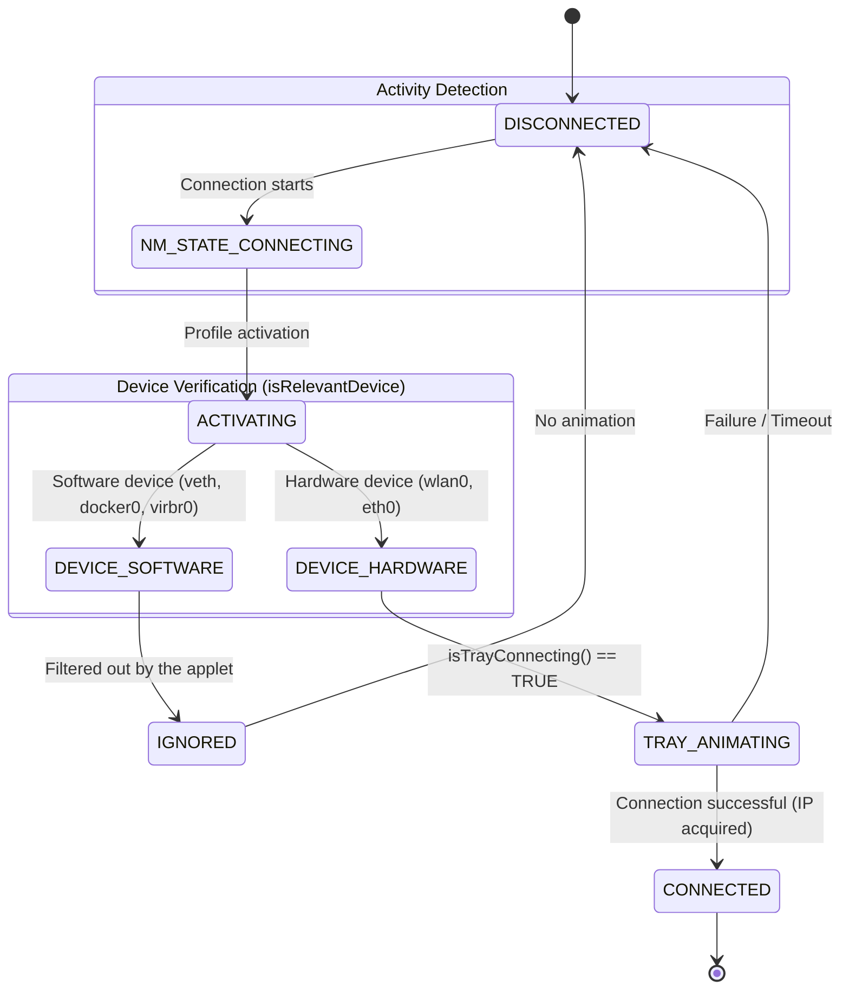
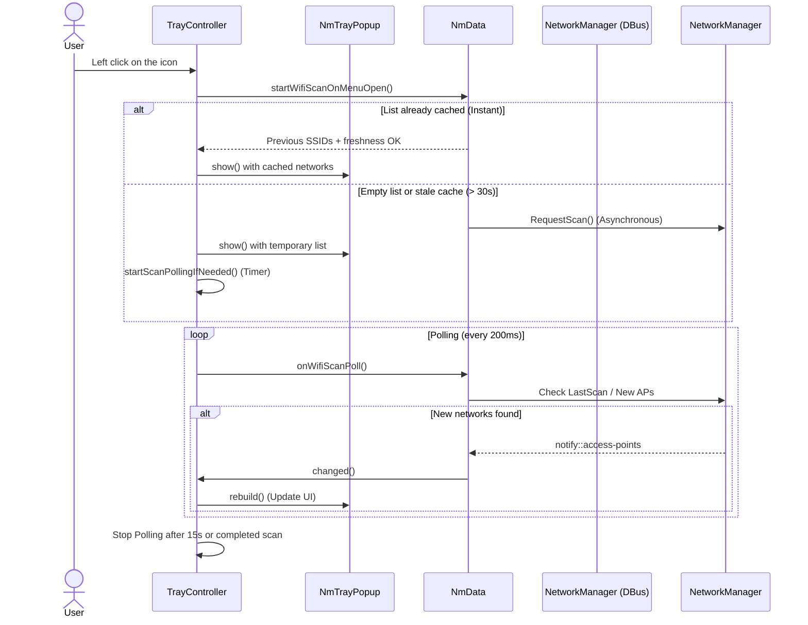
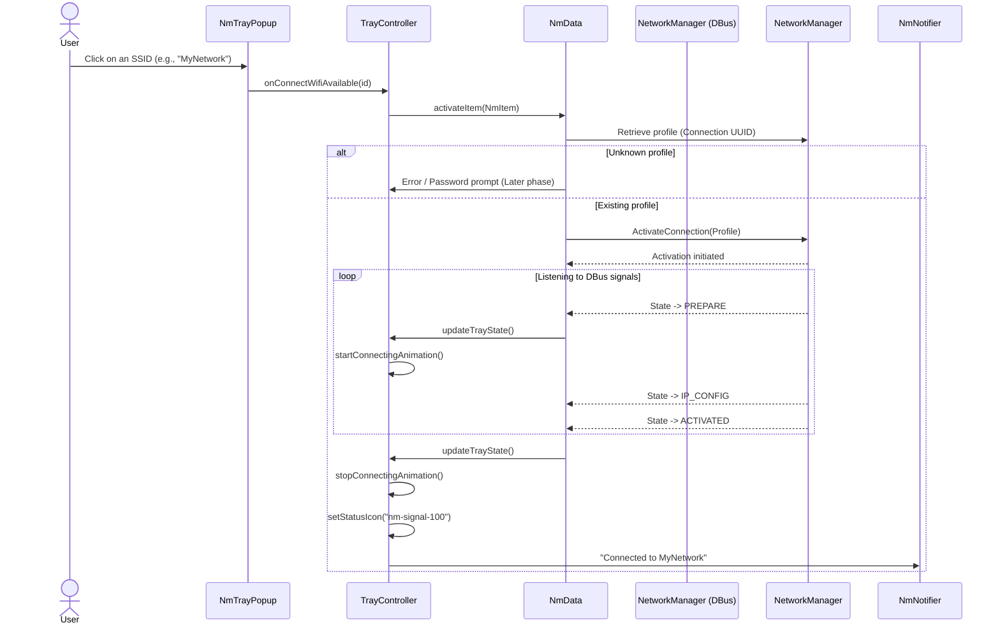
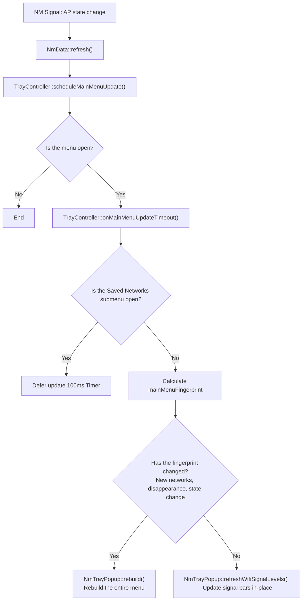

# Business Logic and Lifecycle of nm-tray-tde

This document gathers sequence and state diagrams modeling the underlying business logic of the `nm-tray-tde` applet. These diagrams serve as a reference to ensure all scenarios (connection in progress, Wi-Fi refresh, device filtering) are correctly handled by the code.

## 1. Network Connection Lifecycle (Systray Animation)

The applet relies on a system of asynchronous states from NetworkManager to determine whether it should animate the system tray icon.

### Animation Rules
- **isTrayConnecting()** evaluates whether the NM *Global State* is in `CONNECTING`, **OR** if a hardware connection (`anyActivatingConnection`) is in the activation phase, **OR** if a hardware device (`anyDeviceConnecting`) is currently being configured.
- Virtual interfaces (such as those generated by Docker/Libvirt) are strictly ignored to prevent an endless DHCP configuration of a container from locking the applet in a "Connecting" state.

---

## 2. Wi-Fi Scan Strategy (Hybrid)

The applet implements a hybrid Wi-Fi scan strategy inspired by `nmcli`, combined with a persistent cache to ensure instant menu opening.

---

## 3. Existing Wi-Fi Profile Activation

When a user clicks on a Wi-Fi network in the menu to connect to it, the applet handles deactivating concurrent connections and initiates the activation.

---

## 4. Menu Refresh Logic (Fingerprint)

To prevent the open menu from "flickering" or unexpectedly closing when the Wi-Fi signal strength fluctuates, the applet uses a fingerprinting system.

